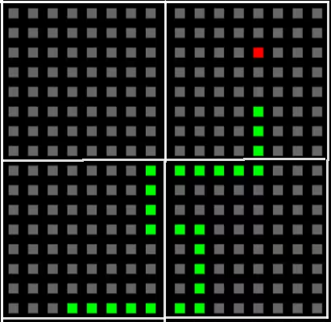
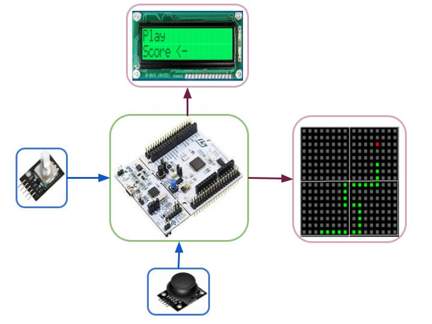

# TP Final  Definición de Requisitos y Casos de Uso 

## Nicolás Ferragamo
## nferragamo@abc.gob.ar

# Selección del proyecto a implementar
Una de las razones por las que quise participar en este curso fue el poder adquirir capacidades nuevas que pueda implementar en mis clases como docente de escuela técnica secundaria. Con el fin de mejorar la calidad de las mismas e implementar flujos de trabajo mas acordes a la industria actual, de forma tal de poder brindarles una mejor formación a mis alumnos.

Los proyectos analizados se basan en la idea de poder implementarlos en el aula, como parte de las clases de aplicaciones de electrónica digital, teniendo en cuenta los aprendizajes y habilidades que se espera desarrollen los alumnos. 

* Proyecto 1: **Juego snake en una matriz de neopixeles**.
* Proyecto 2: **Invernadero automatizado.**
* Proyecto 3: **Alimentador de mascotas automático.**

Los aspectos a analizar a la hora de elegir entre los proyectos son los siguientes:

* Complejidad del proyecto.
* Utilidad del proyecto en el aula.
* Aprendizajes que se espera adquieran los alumnos.
* Posibilidad de implementación en el aula.
* Costo del proyecto.
* Interés posible de los alumnos.

En la tabla 1 se puede apreciar una comparativa de los pesos asignados a cada aspecto a analizar para cada proyecto.

| Proyecto | Complejidad  (-5)| Aprendizajes (10) | Implementación en el aula (10)| Costo (-5)| Interés de los alumnos (10)| Peso final |
| --- | --- | --- | --- | --- | --- | --- |
| Proyecto 1 score | 8| 8 | 8 | 6 | 8 | - |
| Proyecto 1 weight | -40 | 80 | 80 |-60 | 80 | **140** |
| Proyecto 2 score | 8 | 9 | 6 | 6 | 6 | 7 |
| Proyecto 2 weight | -40 | 90 | 60 | -60 | 70 | 120 |
| Proyecto 3 score | 5 | 6 | 6 | 7 | 6 | - |
| Proyecto 3 weight | -25 | 60 | 60 | -70 | 60 | 85 |

Tabla 1: Comparativa de los puntajes asignados a cada aspecto a analizar para cada proyecto.

La complejidad de los proyectos son acordes a los contenidos que se ven en la materia y los contenidos extras que se pueden ver en la misma. Se puntuó de esta forma teniendo en cuenta los conocimientos previos, los esperados y acorde al tiempo disponible para la realización del proyecto.

Acorde a lo mencionado en el párrafo anterior, los aprendizajes se puntuaron de acuerdo al programa de la materia y las expectativas de logros de la misma.

La implementación en el aula es un aspecto importante a tener en cuenta, ya que dependiendo el proyecto podemos tener limitaciones de espacio y de herramientas necesarias para la realización del mismo.

En cuanto al costo, dado que estamos pasando una situación económica complicada, en muchos casos los alumnos no pueden acceder a materiales costosos. Dicho esto, se puntuó de acuerdo a la cantidad de materiales necesarios, su costo y la disponibilidad de materiales que cuenta la escuela que puedan ser útiles para los proyectos.

El último ítem considerado, es de importancia ya que pretendemos que los alumnos se sientan motivados a realizar el proyecto. La motivación ayuda a la finalización del trabajo, a la calidad del mismo y a la adquisición de los aprendizajes esperados e incluso de aprendizajes extras.

Considerando todos los aspectos mencionados, y teniendo en  cuenta que lo lúdico puede generar motivación extra en los alumnos, se decidió implementar el proyecto 1: **Juego snake en una matriz de neopixeles**. El juego elegido es una motivación propia, ya que es un juego que me gusta y que me gustaría poder implementar en el aula debido a que tiene una complejidad aceptable. En otras implementaciones o al trabajar en distintos grupos se podrían implementar distintos juegos.

## Snake game 

La finalidad del proyecto como se menciono anteriormente es implementar un proyecto que sea de interés para los alumnos y que a su vez sea un desafío para ellos. El juego snake es un juego que tiene una complejidad aceptable y que puede ser de interés para ellos. 

Luego de analizar diferentes opciones que se presentan en la web, se decidió implementar el juego snake en una matriz de neopixeles. Para ello se utilizaran 4 matrices de 8x8.

En la Fig 1 se puede apreciar cómo se vería el juego en una matriz de neopixeles.

Fig:1 Matriz de neopixeles

A diferencia de otros proyectos vistos, se le agregará una pantalla LCD 2x16 que auspiciará de interfaz con el usuario, ya que por una cuestión de costos no se utilizará una matriz mas grande que permita mostrar mensajes en la misma.

Se utilizará un encoder para navegar por el menú del juego y un pulsador para seleccionar la opción deseada. Al mismo tiempo se utilizará un joystick como mando del juego.

El juego contará con un menú principal que permitirá seleccionar entre jugar ver los puntajes anteriores y seleccionar la dificultad del juego.

En la Fig 2 se puede apreciar el diagrama de bloques del sistema. En el mismo se puede observar los distintos módulos que lo componen el proyecto. A grandes rasgos tenemos dos módulos de entrada, el encoder que permitirá la navegación por el menú y el joystick que permitirá el movimiento de la serpiente. Por otro lado tenemos dos módulos de salida, la matriz de neopixeles que mostrará el juego y la pantalla LCD que mostrará el menú y los puntajes. Por último tenemos la placa de desarrollo STm-nucleo 401RE que será la encargada de controlar todo el sistema.

 

# Elicitación de requisitos y casos de uso

Existen diferentes modelos de este proyecto implementados por hobbistas. A continuación se presentan algunos de ellos 

|Características| Proyecto 1 | Proyecto 2 | Proyecto 3 | Proyecto 4 |
| --- | --- | --- | --- | --- |
|Pantalla de juego| Matriz de leds 8x8 4 módulos | LCD gráfico 128x64 | Oled 1,3" 128x64 | Matriz neopixel 16x 32 |
|Mando| Joystick | 4 botones | 4 botones | Joystick |
|Pantalla auxiliar| Display 7-seg | En la misma pantalla | En la misma pantalla | En la misma pantalla |
|Menú| En la misma pantalla + Display 7-seg | No posee | En la misma pantalla | En la misma pantalla |
|Score| 7 seg | En la misma pantalla | En la misma pantalla | No lo muestra hasta perder |
|Color| No| No | No | Si |
|Costo| Medio | Medio | Medio | Alto |
|Record| Si | No | No | No | 

Tabla 2: Comparativa de los proyectos analizados.

La idea que mas me agrada es la del uso de una pantalla LCD 128x64 para mostrar el menú y los puntajes. Sin embargo, el protocolo SPI para la comunicación es algo que no se ha visto en la materia y que puede ser un desafío demasiado grande para los alumnos, ademas son pantallas que no se encuentran en la escuela y costosas. La matriz de puntos es una opción viable, ya que se encuentran disponibles en la escuela, sin embargo 8 puntos no son suficientes para una buena experiencia de juego. Finalmente se opta por la matriz de neopixel ya que a pesar de ser un poco costosas cuento con 4 de 8x8, lo que permitirá una buena experiencia de juego y es un desafío interesante para los alumnos.

La decisión de agregar una segunda pantalla LCD 16x2 se debe a que la interfaz con el usuario no es agradable en la matriz de neopixeles debido a la poca cantidad de píxeles. Sin embargo parece ser una buena excusa para agregar el módulo que es parte del temario de la materia.

En cuanto al mando, se opta por el joystick ya que nos permite implementar el módulo ADC que es parte del temario de la materia, así como el encoder que permite implementar el el tema de interrupciones. 

Posiblemente no sean las mejores decisiones desde un punto de vista comercial, pero se tomo la decisión implementarlo de esta forma por fines didácticos.

Links de los proyectos:

[proyecto 1](https://www.instructables.com/Snake-Game-With-Arduino/)

[proyecto 2](https://www.youtube.com/watch?app=desktop&v=Fiws8pobdTM)

[proyecto 3](https://www.youtube.com/watch?v=YWcjwHi7MtM/)

[proyecto 4](https://www.youtube.com/watch?v=G16ej5IbYTQ/)

## Requerimientos

En la tabla 3 se presentan los requerimientos del sistema.

|Grupo de Requerimientos| ID del Requerimiento | Descripción |
| --- | --- | --- |    
|Modos|1.1 | **"Play**" El sistema estará ejecutando el juego en la pantalla neopixel y mostrará el score en el menú|
|Modos|1.1.1 | La pantalla LCD mostrará el puntaje y permitirá pausar el juego|
|Modos|1.1.2 | Se podrá finalizar el juego|
|Modos|1.2 | **"Score"** El sistema mostrará los puntajes más altos en la pantalla LCD. Un total de 10 marcas.|
|Modos|1.2.1 | Se podrán borrar los puntajes|
|Modos|1.3 | **"Dificultad"** El sistema permitirá seleccionar la dificultad del juego. *"Fácil"*, *"Medio"* y *"Difícil"*. Cambia la velocidad con la que se ejecuta el movimiento de la serpiente.|
|Configuración|2.1 | El sistema permitirá configurar el juego utilizando un encoder.|
|Mando de control| 3.1 | El sistema permitirá controlar la serpiente utilizando un joystick.|
|Mando de control| 3.2 | El sistema permitirá pausar el juego con el pulsador del joystick.|
|Pantalla| 4.1 | El sistema mostrará el menú en la pantalla LCD.|
|Pantalla| 4.1.1 | Se visualizará el menú de navegación|
|Pantalla| 4.1.2 | Se visualizará el puntaje |
|Pantalla| 4.1.3 | Se visualizará el puntaje más alto|
|Pantalla| 4.1.4 | Se visualizará la dificultad seleccionada|
|Pantalla| 4.2 | El juego se mostrará en la matriz de neopixeles.|
|Pantalla| 4.2.1 | Se visualizará la serpiente, el cuerpo de un color y la cabeza de la serpiente de otro color|
|Pantalla| 4.2.2 | Los frutos se visualizarán de un color distinto al de la serpiente|
|Alimentación| 5.1 | El sistema funcionará con una fuente de 5 V|
|Costo| 6.1 | El costo del proyecto no superará los $15000 (sin tener en cuenta la placa de desarrollo y la matriz de neopixeles)|
|Tiempo de ejecución| 7.1 | El proyecto se entregará antes del 17 de Septiembre de 2024.|
 |Manual de uso y Documentación| 8.1 | Se entregará un manual de uso y documentación del proyecto.| El prototipo se entregará acompañado de el código fuente que estará disponible en un repositorio de github, junto con la lista de materiales, un informe de avance, un informe final, requisitos logrados|

Tabla 3: Requerimientos del sistema.

## Casos de uso

|Caso de uso | Descripción |
| --- | --- |
| ID| 1 |
| Nombre | Iniciar juego |
|Disparador| El usuario selecciona la opción "Play" en el menú y presiona el botón del encoder|
|Condición previa| El sistema esta listo para ejecutarse |
|Flujo básico| Se muestra la serpiente en la pantalla de neopixel, se coloca una fruta. La pantalla LCD pasa a mostrar el score actual y la palabra *"Salir"* |
|Flujo alternativo| Se queda esperando en el menú principal |

Tabla 4: Caso de uso 1

|Caso de uso | Descripción |
| --- | --- |
| ID| 2 |
| Nombre | Pausar juego |
|Disparador| El usuario presiona el botón del joystick|
|Condición previa| El sistema esta en modo juego, se esta ejecutando el mismo |
|Flujo básico| Se deja de ejecutar el juego y queda en la pantalla el último valor. Se muestra en el menú del LCD la palabra *"pausa* |
|Flujo alternativo| Se sigue ejecutando el juego |

Tabla 5: Caso de uso 2

|Caso de uso | Descripción |
| --- | --- |
| ID| 3 |
| Nombre | Salir del juego |
|Disparador| El usuario selecciona la opción "Salir" en el menú y presiona el botón del encoder|
|Condición previa| El sistema esta en modo juego **corriendo** ó en modo **pausa** |
|Flujo básico| Se deja de ejecutar el juego y queda en la pantalla el último valor. Se muestra en el menú del LCD el menú principal |
|Flujo alternativo| Se sigue ejecutando el juego |

Tabla 6: Caso de uso 3

|Caso de uso | Descripción |
| --- | --- |
| ID | 4 |
| Nombre | Score |
|Disparador| El usuario selecciona la opción "Score" en el menú y presiona el botón del encoder|
|Condición previa| El sistema esta en modo principal esperando la selección |
|Flujo básico| Se visualiza en la pantalla la lista de los 10 mejores puntajes.|
|Flujo alternativo| Se queda esperando en el menú principal |

Tabla 6: Caso de uso 4

|Caso de uso | Descripción |
| --- | --- |
| ID | 5 |
| Nombre | Score |
|Disparador| mueve el encoder hacia la derecha o izquierda|
|Condición previa| El sistema esta en modo **"Score**  |
|Flujo básico| 5.a. Si el menú esta en 1 y gira el encoder a la derecha, actualiza la pantalla con el score 3 y 4. Siguiendo esta lógica hasta el score 9 y 10.|
|Flujo básico| 5.b. Si el menú esta en 1 y gira el encoder a la izq, actualiza la pantalla con el score 10 y 9.|
|Flujo básico| 5.c. Si el menú esta en 9 y 10 y gira el encoder a la izquierda, actualiza la pantalla con el escore 7 y 8. Siguiendo esta lógica hasta el score 1 y 2|
|Flujo básico| 5.d. Si el menú esta en 9 y 10 y gira el encoder a la derecha, actualiza la pantalla con el score 1 y 2. Siguiendo esta lógica hasta el score 9 y 10|
|Flujo alternativo| Se queda esperando en movimiento del encoder |

Tabla 6: Caso de uso 5

|Caso de uso | Descripción |
| --- | --- |
| ID | 6 |
| Nombre | Dificultad |
|Disparador| El usuario selecciona la opción "Dificultad" en el menú y presiona el botón del encoder|
|Condición previa| El sistema esta en modo **"Dificultad"**  |
|Flujo básico| Se ingresa al menú Dificultad y se muestra en la pantalla el modo "Fácil" y el "Medio" |
|Flujo alternativo| Se queda esperando en movimiento del encoder |

Tabla 7: Caso de uso 6

|Caso de uso | Descripción |
| --- | --- |
| ID | 7 |
| Nombre | Dificultad |
|Disparador| El usuario mueve el encoder|
|Condición previa| El sistema esta en modo **"Dificultad"**  |
|Flujo básico| 7.a. Se muestra en la pantalla el "difícil" y "salir" |
|Flujo básico| 7.b. Se muestra en la pantalla el "Fácil" y "medio" |
|Flujo alternativo| Se queda mostrando lo mismo que antes esperando un comando válido |

Tabla 8: Caso de uso 7

|Caso de uso | Descripción |
| --- | --- |
| ID | 8 |
| Nombre | Dificultad |
|Disparador| El usuario presiona el botón del encoder|
|Condición previa| El sistema esta en modo **"Dificultad"**  |
|Flujo básico| 8.a. si se seleccionó un nivel de dificultad, se configura y se vuelve al menú principal |
|Flujo básico| 8.b. Si se selecciono salir, se vuelve al menú principal||Flujo alternativo| Se queda mostrando lo mismo que antes esperando un comando válido |

Tabla 9: Caso de uso 8
